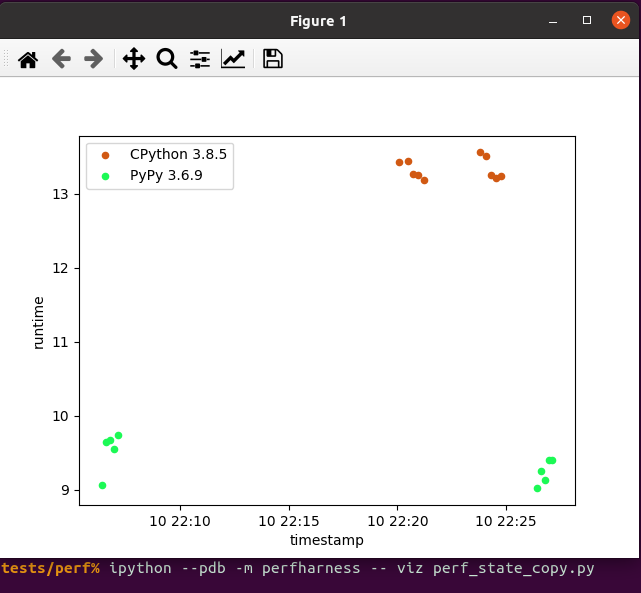

# perfharness

Perfharness is a python library for tracking testcase performance over time.

# How to use it

Install perfharness with `pip install perfharness`.

Write a perfharness testcase by building a python module with a `main` function that takes no arguments.
You can do any setup you need in the root module namespace so that the code which actually gets timed can be in `main`.

Configure perfharness by putting a `.perfharness.ini` file in the current directory.
Here is a sample configuration:

```
[perfharness]
sources_root = ../../..
sources = angr/angr,angr/angr_native,pyvex/pyvex,pyvex/pyvex_c,archinfo/archinfo,claripy/claripy,cle/cle,ailment/ailment
sources_ignore = *.o,*.so,*.a,*.pyc
build = pip install -e ./angr -e ./pyvex
cpu_percent_less_than = 10
mem_available_greater_than = 3gb
# https://docs.sqlalchemy.org/en/14/core/engines.html#database-urls
database = sqlite:///perf.db
```

Run perfharness with `python -m perfharness run [options] testcase.py`.
Valid options include `--num [n]` to collect `n` runs of data and `--warmup [n]` to run the testcase `n` times before collecting any data.

Visualize your testcase performance over time with `python -m perfharness viz [options] testcase.py`.
Different colors will be used to demarcate different attributes which might affect performance, such as the cpu and the python version.


